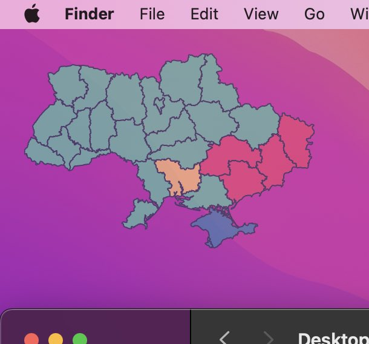

# Air raid widget for macOS

## Installation
1. Download [Übersicht](http://tracesof.net/uebersicht/)
2. Download the widget `git clone https://github.com/dr-mod/air-raid-widget-macos.git`
3. Open the Übersicht widgets folder `[Ubersicht icon -> Open widgets folder]`
2. Copy `air-raid-widget-macos` to the Übersicht widgets folder.

